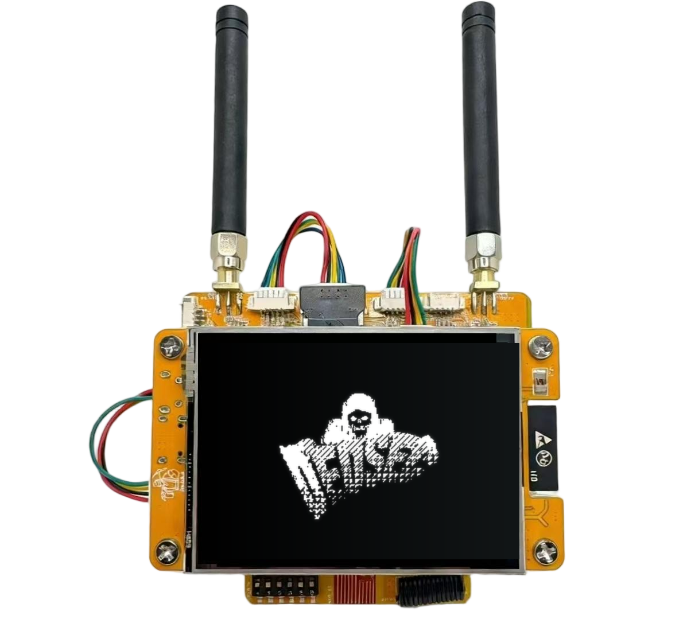

<p align="center">
  
</p>

# DedSec-Hat

**A personal [Bruce](https://github.com/pr3y/Bruce) fork for the [NM-RF-HAT](https://rockbase.shop) on an ESP32-2432S028 (CYD)**, by [fazelucq](https://github.com/fazelucq1).

Same offensive-security toolkit Bruce is known for — WiFi/BLE/Sub-GHz/RFID/IR attacks, all on cheap ESP32 hardware — rebranded and extended for my own RF pentest rig, plus a few fixes and a new Sub-GHz wardriving module.

> ⚖️ **Authorized use only.** Built and used for legal, authorized security testing on hardware I own or have explicit permission to test.

## :clapper: What's different from upstream Bruce

This is a source fork, not an independent project — it's built on top of [pr3y/Bruce](https://github.com/pr3y/Bruce) (AGPLv3) and keeps that license. Full write-up of every change, with the reasoning behind each, is in [CUSTOM_FIRMWARE_CHANGES.md](./CUSTOM_FIRMWARE_CHANGES.md). Short version:

- **Rebrand:** boot screen, status bar and the Device Info screen now read "DEDSEC"/"1.0" instead of "Bruce", with `Author: fazelucq`. Custom black-and-white glitch boot animation (`data/boot.gif`, shown above) replaces the stock shark splash — shipped via LittleFS, no SD card needed. Default UI color changed from Bruce's purple to white/light-grey.
- **New module — RF Wardriving:** `src/modules/rf/rf_wardriving.*` — geo-tags captured Sub-GHz (CC1101) OOK/ASK signals with GPS to CSV (`GPS → Wardriving → Scan Sub-GHz`). Bruce's wardriving was WiFi/BLE only before this.
- **New feature — RollJam (exp.):** `src/modules/rf/rf_rolljam.*` — single-radio jam/capture approximation for testing rolling-code garage/car remotes, added to the RF menu.
- **Fix — stuck RF/RFID screens:** "[ESC] to stop" could hang on this board when the touch poll got starved by tight SPI timing loops. Added a BOOT-button (GPIO0) force-stop that bypasses touch entirely, wired into every blocking scan/listen/jam/RFID loop.
- **Fix/UX — visible back button:** a small "←" chevron, top-center, replacing an invisible touch-only zone.
- **NRF24 jammer — new "BLE Full" mode:** covers the real 40-channel BLE band with the 3 actual advertising channels weighted higher, replacing a channel table that didn't match real BLE frequencies.
- **RF Bruteforce — "Try All":** runs all 6 supported fixed-code protocols back-to-back instead of one at a time.

## :building_construction: Build & flash

Built with PlatformIO for the `CYD-2432S028` environment:

```sh
pio run -e CYD-2432S028                                   # build firmware
esptool.py --chip esp32 write-flash -z 0x0 Bruce-CYD-2432S028.bin

pio run -e CYD-2432S028 --target uploadfs                 # separate step: flashes data/boot.gif via LittleFS
```

## :keyboard: Upstream Bruce resources

The feature set below, the wiki, and the Discord are upstream Bruce's — still accurate for everything this fork didn't touch.

- [Discord Server](https://discord.gg/WJ9XF9czVT)
- [Wiki](https://wiki.bruce.computer/) / [FAQ](https://wiki.bruce.computer/faq/)

## :computer: List of Features

<details>
  <summary><h2>WiFi</h2></summary>

- [x] Connect to WiFi
- [x] WiFi AP
- [x] Disconnect WiFi
- [x] [WiFi Atks](https://wiki.bruce.computer/features/wifi/#wifi-atks)
  - [x] [Beacon Spam](https://wiki.bruce.computer/features/wifi/#beacon-spam)
  - [x] [Target Atk](https://wiki.bruce.computer/features/wifi/#target-atks)
    - [x] Information
    - [x] Target Deauth
    - [x] EvilPortal + Deauth
  - [x] Deauth Flood (More than one target)
- [x] [Wardriving](https://wiki.bruce.computer/features/gps/#wardriving)
- [x] [TelNet](https://wiki.bruce.computer/features/wifi/#telnet)
- [x] [SSH](https://wiki.bruce.computer/features/wifi/#ssh)
- [x] [RAW Sniffer](https://wiki.bruce.computer/features/wifi/#raw-sniffer)
- [x] [TCP Client](https://wiki.bruce.computer/features/wifi/#client-tcp)
- [x] [TCP Listener](https://wiki.bruce.computer/features/wifi/#listen-tcp)
- [x] [Evil Portal](https://wiki.bruce.computer/features/wifi/#evil-portal)
- [x] [Scan Hosts](https://wiki.bruce.computer/features/wifi/#scan-hosts) (with TCP Port scanning)
- [x] [Responder](https://wiki.bruce.computer/features/wifi/#responder)
- [x] [Arp Spoofing](https://wiki.bruce.computer/features/wifi/#arp-spoofing)
- [x] [Arp Poisoning](https://wiki.bruce.computer/features/wifi/#arp-poisoning)
- [x] [Wireguard Tunneling](https://wiki.bruce.computer/features/wifi/#wireguard-tunneling)
- [x] Brucegotchi
  - [x] Pwnagotchi friend
  - [x] Pwngrid spam faces & names
    - [x] [Optional] DoScreen a very long name and face
    - [x] [Optional] Flood uniq peer identifiers

</details>

<details>
  <summary><h2>BLE</h2></summary>

- [x] [BLE Scan](https://wiki.bruce.computer/features/ble/#ble-scan)
- [x] Bad BLE - Run Ducky scripts, similar to [BadUsb](https://wiki.bruce.computer/features/ble/#badble)
- [x] BLE Keyboard - Cardputer and T-Deck Only
- [x] iOS Spam
- [x] Windows Spam
- [x] Samsung Spam
- [x] Android Spam
- [x] Spam All
</details>

<details>
  <summary><h2>RF</h2></summary>

- [x] Scan/Copy
- [x] [Custom SubGhz](https://wiki.bruce.computer/features/rf/#replay-payloads-like-flipper)
- [x] Spectrum
- [x] Jammer Full (sends a full squared wave into output)
- [x] Jammer Intermittent (sends PWM signal into output)
- [x] Config
  - [x] RF TX Pin
  - [x] RF RX Pin
  - [x] RF Module
    - [x] RF433 T/R M5Stack
    - [x] [CC1101 (Sub-Ghz)](https://wiki.bruce.computer/features/rf/#cc1101)
  - [x] RF Frequency
- [x] Replay
</details>

<details>
  <summary><h2>RFID</h2></summary>

- [x] Read tag
- [x] Read 125kHz
- [x] Clone tag
- [x] Write NDEF records
- [x] Amiibolink
- [x] Chameleon
- [x] Write data
- [x] Erase data
- [x] Save file
- [x] Load file
- [x] Config
  - [x] [RFID Module](https://wiki.bruce.computer/features/rfid/#supported-modules)
    - [x] PN532
    - [x] PN532Killer
- [ ] Emulate tag
</details>

<details>
  <summary><h2>IR</h2></summary>

- [x] TV-B-Gone
- [x] IR Receiver
- [x] [Custom IR (NEC, NECext, SIRC, SIRC15, SIRC20, Samsung32, RC5, RC5X, RC6)](https://wiki.bruce.computer/features/ir/#replay-payloads-like-flipper)
- [x] Config - [X] Ir TX Pin - [X] Ir RX Pin
</details>

<details>
  <summary><h2>FM</h2></summary>

- [x] [Broadcast standard](https://wiki.bruce.computer/features/fm/#broadcast-standard)
- [x] [Broadcast reserved](https://wiki.bruce.computer/features/fm/#broadcast-standard)
- [x] [Broadcast stop](https://wiki.bruce.computer/features/fm/#broadcast-stop)
- [ ] [FM Spectrum](https://wiki.bruce.computer/features/fm/#fm-spectrum)
- [ ] [Hijack Traffic Announcements](https://wiki.bruce.computer/features/fm/#hijack-ta)
- [ ] [Config](https://wiki.bruce.computer/features/fm/#bookmark_tabs-config)
</details>

<details>
  <summary><h2>NRF24</h2></summary>

- [x] [NRF24 Jammer](https://wiki.bruce.computer/features/nrf24/)
- [x] 2.4G Spectrum
- [ ] Mousejack
</details>

<details>
  <summary><h2>Scripts</h2></summary>

- [x] [JavaScript Interpreter](https://wiki.bruce.computer/features/js-interpreter/) [Credits to justinknight93](https://github.com/justinknight93/Doolittle)
</details>

<details>
  <summary><h2>Others</h2></summary>

- [x] Mic Spectrum
- [x] [QRCodes](https://wiki.bruce.computer/features/others/#qrcodes)
  - [x] Custom
  - [x] PIX (Brazil bank transfer system)
- [x] [SD Card Mngr](https://github.com/pr3y/Bruce/wiki/Others#sd-card-mngr)
  - [x] View image (jpg)
  - [x] File Info
  - [x] [Wigle Upload](https://wiki.bruce.computer/features/gps/#how-to-use-wigle)
  - [x] Play Audio
  - [x] View File
- [x] LittleFS Mngr
- [x] [WebUI](https://wiki.bruce.computer/controlling-device/webui/)
  - [x] Server Structure
  - [x] Html
  - [x] SDCard Mngr
  - [x] Spiffs Mngr
- [x] Megalodon
- [x] [BADUsb (New features, LittleFS and SDCard)](https://wiki.bruce.computer/features/others/#badusb)
- [x] USB Keyboard - Cardputer and T-Deck Only
- [x] [iButton](https://wiki.bruce.computer/features/others/#ibutton)
- [x] LED Control
</details>

<details>
  <summary><h2>Clock</h2></summary>

- [x] RTC Support
- [x] NTP time adjust
- [x] Manual adjust
</details>

<details>
  <summary><h2>Connect (ESPNOW)</h2></summary>

- [x] Send File
- [x] Receive File
- [x] Send Commands
- [x] Receive Commands
</details>

<details>
  <summary><h2>Config</h2></summary>

- [x] Brightness
- [x] Dim Time
- [x] Orientation
- [x] UI Color
- [x] Boot Sound on/off
- [x] Clock
- [x] Sleep
- [x] Restart
</details>

## Specific functions per Device, the ones not mentioned here are available to all.

| Device                                                                                                                                                                                      | CC1101 | NRF24 | FM Radio |        PN532         | Mic  | BadUSB | RGB Led | Speaker | Fuel Gauge | LITE_VERSION |
| ------------------------------------------------------------------------------------------------------------------------------------------------------------------------------------------- | :----: | :---: | :------: | :------------------: | :--: | :----: | :-----: | :-----: | :--------: | :----------: |
| [M5Stack Cardputer](https://shop.m5stack.com/products/m5stack-cardputer-kit-w-m5stamps) (and ADV)                                                                                           |  :ok:  | :ok:  |   :ok:   |         :ok:         | :ok: |  :ok:  |  :ok:   | NS4168  |    :x:     |     :x:      |
| [M5Stack M5StickC PLUS2](https://shop.m5stack.com/products/m5stickc-plus2-esp32-mini-iot-development-kit)                                                                                   |  :ok:  | :ok:  |   :ok:   |         :ok:         | :ok: | :ok:¹  |   :x:   |  Tone   |    :x:     |     :x:      |
| [M5Stack M5StickC PLUS](https://shop.m5stack.com/products/m5stickc-plus-esp32-pico-mini-iot-development-kit)                                                                                |  :ok:  | :ok:  |   :ok:   |         :ok:         | :ok: | :ok:¹  |   :x:   |  Tone   |    :x:     |     :x:²     |
| [M5Stack M5Core BASIC](https://shop.m5stack.com/products/basic-core-iot-development-kit)                                                                                                    |  :ok:  | :ok:  |   :ok:   |         :ok:         | :ok: | :ok:¹  |   :x:   |  Tone   |    :x:     |     :x:      |
| [M5Stack M5Core2](https://shop.m5stack.com/products/m5stack-core2-esp32-iot-development-kit-v1-1)                                                                                           |  :ok:  | :ok:  |   :ok:   |         :ok:         | :ok: | :ok:¹  |   :x:   |   :x:   |    :x:     |     :x:      |
| [M5Stack M5CoreS3](https://shop.m5stack.com/products/m5stack-cores3-esp32s3-lotdevelopment-kit)/[SE](https://shop.m5stack.com/products/m5stack-cores3-se-iot-controller-w-o-battery-bottom) |  :ok:  | :ok:  |   :ok:   |         :ok:         | :x:  |  :ok:  |   :x:   |   :x:   |    :x:     |     :x:      |
| [JCZN CYD&#x2011;2432S028](https://www.aliexpress.us/item/3256804774970998.html)                                                                                                            |  :ok:  | :ok:  |   :ok:   |         :ok:         | :x:  | :ok:¹  |   :x:   |   :x:   |    :x:     |     :x:²     |
| [Lilygo T&#x2011;Embed CC1101](https://lilygo.cc/products/t-embed-cc1101)                                                                                                                   |  :ok:  | :ok:  |   :ok:   |         :ok:         | :ok: |  :ok:  |  :ok:   |  :ok:   |    :ok:    |     :x:      |
| [Lilygo T&#x2011;Embed](https://lilygo.cc/products/t-embed)                                                                                                                                 |  :ok:  | :ok:  |   :ok:   |         :ok:         | :ok: |  :ok:  |  :ok:   |  :ok:   |    :x:     |     :x:      |
| [Lilygo T-Display-S3](https://lilygo.cc/products/t-display-s3)                                                                                                                              |  :ok:  | :ok:  |   :x:    |         :x:          | :x:  |  :ok:  |   :x:   |   :x:   |    :x:     |     :x:      |
| [Lilygo T&#x2011;Deck](https://lilygo.cc/products/t-deck) ([and pro](https://lilygo.cc/products/t-deck-plus-1))                                                                             |  :ok:  |  :x:  |   :x:    |         :x:          | :x:  |  :ok:  |   :x:   |   :x:   |    :x:     |     :x:      |
| [Lilygo T-Watch-S3](https://lilygo.cc/products/t-watch-s3)                                                                                                                                  |  :x:   |  :x:  |   :x:    |         :x:          | :x:  |  :ok:  |   :x:   |   :x:   |    :x:     |     :x:      |
| [Lilygo T-LoRa Pager](https://lilygo.cc/products/t-lora-pager)                                                                                                                              |  :x:   |  :x:  |   :x:    |         :x:          | :x:  |  :ok:  |   :x:   |   :x:   |    :x:     |     :x:      |
| [Smoochiee V2](https://www.pcbway.com/project/shareproject/Bruce_PCB_Smoochiee_d6a0284b.html)                                                                                               |  :ok:  | :ok:  |   :x:    |         :ok:         | :x:  |  :ok:  |   :x:   |   :x:   |    :x:     |     :x:      |
| [ESP32-C5](https://docs.espressif.com/projects/esp-dev-kits/en/latest/esp32c5/esp32-c5-devkitc-1/user_guide.html)                                                                           |  :ok:  | :ok:  |   :x:    |         :ok:         | :x:  |  :x:   |   :x:   |   :x:   |    :x:     |     :x:      |
| [Bruce RF Reaper](https://www.elecrow.com/bruce-pcb-rf-reaper.html)                                                                                                                         |  :ok:  | :ok:  |   :x:    | :ok: but w/ ST25R3916 | :x:  |  :ok:  |  :ok:   |   :x:   |    :ok:    |     :x:      |
| [Elecrow 24B](https://www.elecrow.com/2-4inch-esp32-miner-lcd-display-2pcs-cryptocurrency-solo-miner-with-1000kh-s-hashrate.html)                                                            |  :ok:  | :ok:  |   :ok:   |         :ok:         | :x:  | :ok:¹  |   :x:   |   :x:   |    :x:     |     :x:²     |
| [Elecrow 3.5"](https://www.elecrow.com/esp-terminal-with-esp32-3-5-inch-parallel-480x320-tft-capacitive-touch-display-rgb-by-chip-ili9488.html)                                                                                                                                                        |  :ok:  | :ok:  |   :ok:   |         :ok:         | :x:  | :ok:¹  |   :x:   |   :x:   |    :x:     |     :x:²     |
| [NM-CYD-C5 + RF HAT](https://https://rockbase.shop/products/nm-cyd-c5-colorful)                                                                                                                         |  :ok:  | :ok:  |   :x:    | :ok: | :x:  |  :ok:  |  :ok:   |   :x:   |    :ok:    |     :x:      |
² CYD have a LITE_VERSION version for Launcher Compatibility
¹ Core, CYD and StickCs Bad-USB: [here](https://wiki.bruce.computer/features/others/#badusb)

_LITE_VERSION_: TelNet, SSH, WireGuard, ScanHosts, RawSniffer, Brucegotchi, BLEBacon, BLEScan and Interpreter are NOT available for M5Launcher Compatibility

<p align="center">
  
</p>
